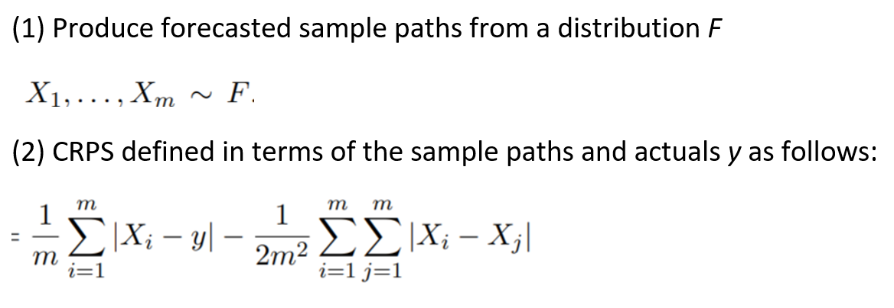

# DATA 598 Capstone

### Instructions

Overview:

The capstone will assess your ability to prepare a technical report as well as
produce calibrated predicted sample paths for stock closing prices.
You will be given 21 different time series to analyze/forecast. The goal
is not for you to demonstrate expertise in understanding financial time series,
but rather, leverage what you have learned in this course as well as
conduct your own literature review to decide on the right methodology.
You are free to pursue any methodology as long as you can explain how to
implement it in a production setting for generating sample paths.

Forecasts will be evaluated based on the continuous ranked probability score (CRPS)

Report:

It is expected that 6 distinct reports detailing the analysis and approach are to be uploaded in pdf format following
the naming convention report_stocks_group#.pdf, where group# is replaced with your
assigned group number.

Reports should not exceed more than 2 pages, excluding references!
While each group is free to decide on the flow/format of their paper, here
are some considerations that should be addressed:

Short summary of relevant methodological references 
Description of EDA and extracted data insights
Outline/justification of proposed methodology
Provide enough implementation details so that an engineer could deploy your method in  production
Method should be scalable as more stocks are added
Method should output sample paths

Forecasts:

You will need to produce 500 sample paths for the closing price for each stock 
for the 14 weeks between 11/1/2019 to 1/31/2020. Refer to the template 
to see the expected format. Specifically, you must upload a CSV file with the
naming convention forecasts_stocks_group#.csv matching the exact column format.
The report and forecasts are both due by: Jun 10 9pm

Data:
A csv file containing each stock time series has been uploaded here.
The stock time series were taken from https://finance.yahoo.com/. 
Each stock has been anonymized with the intention that students only utilize
information from the time series provided for inference and forecasting.
The particular target variable of interest is Close, though students are free to  
use any other columns provided as they see fit.

Note: regardless of your findings or concerns about data quality this is the final
training data that will be provided. Please work with it as given!

